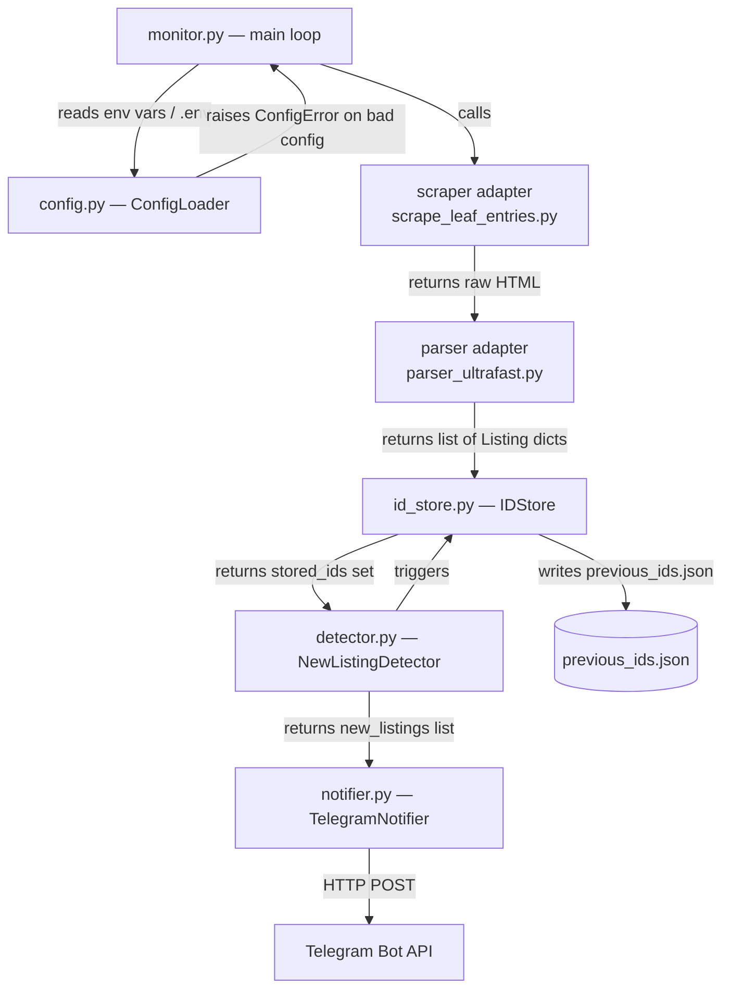

# Design Document

## Overview

The Njuškalo Telegram Notifier is a lightweight Python polling service. It watches a single Njuškalo real-estate search URL and delivers a Telegram message whenever new listings appear. There is no web server, no background worker framework, and no database — the whole service is a single long-running Python script (`monitor.py`) that loops indefinitely.

The design reuses the upstream scraping and parsing modules from the `FraneCal/realestate-listings-pipeline` repository without modification. The new code adds three thin layers on top:

1. A **configuration loader** that reads env vars / `.env` and validates them at startup.
2. An **ID store** backed by `previous_ids.json` that tracks which listings have already been seen.
3. A **Telegram notifier** that composes and dispatches messages through the Bot API.

The primary design constraints are **speed** and **simplicity**: no extra processes, no message queue, no ORM, no async framework — plain synchronous Python with `time.sleep` between cycles.

---

## Architecture



The flow within each polling cycle is strictly linear and synchronous:

```
load config → read ID store → scrape → parse → detect new IDs → notify → write ID store → sleep
```

All components are plain Python modules with no shared mutable state between cycles (the only persistent state lives in `previous_ids.json` on disk).

---

## Components and Interfaces

### `config.py` — Configuration Loader

Responsible for reading, validating, and surfacing all runtime configuration. Called once at startup; the resulting `Config` dataclass is passed around as a value object.

```python
from dataclasses import dataclass

@dataclass(frozen=True)
class Config:
    search_url: str
    bot_token: str
    chat_id: str
    check_interval_minutes: int  # always in [1, 1440]
    log_level: str               # always one of DEBUG/INFO/WARNING/ERROR/CRITICAL

class ConfigError(Exception):
    """Raised when required config is missing or invalid."""

def load_config() -> Config:
    """
    Load configuration from environment (with python-dotenv .env support).
    Raises ConfigError with a descriptive message if validation fails.
    """
```

Validation rules (applied in order):
- Strip each env var value; treat empty-after-strip as absent.
- Require `NJUSKALO_SEARCH_URL`, `TELEGRAM_BOT_TOKEN`, `TELEGRAM_CHAT_ID` — raise `ConfigError` if absent.
- `CHECK_INTERVAL_MINUTES` defaults to `5`; if present, must parse as `int` in `[1, 1440]`.
- `LOG_LEVEL` defaults to `INFO`; if present and not in the valid set, log a warning and fall back to `INFO`.

### `id_store.py` — ID Store

Manages reading from and writing to `previous_ids.json`. All I/O is synchronous. The write path uses the write-to-temp-then-rename pattern to prevent partial writes.

```python
ID_STORE_PATH = "previous_ids.json"
MAX_STORE_SIZE = 1000

def read_ids() -> set[str]:
    """
    Read the stored set of listing IDs.
    Returns empty set if file absent, unreadable, or contains invalid JSON
    (logs appropriate error in each case).
    """

def write_ids(ids: set[str], recently_added: list[str]) -> None:
    """
    Persist ids to previous_ids.json atomically.
    If len(ids) > MAX_STORE_SIZE, retain only the MAX_STORE_SIZE most
    recently added IDs (as tracked by recently_added ordering).
    Uses write-to-temp-then-os.replace() for crash safety.
    """
```

The atomic write sequence:
1. Write JSON to a sibling temp file (`previous_ids.json.tmp`).
2. Call `os.replace(tmp_path, target_path)` — atomic on POSIX, best-effort on Windows.
3. If an exception occurs before the rename, the original file is untouched.

### `scraper_adapter.py` — Scraper Adapter

A thin wrapper that imports and calls the upstream `scrape_leaf_entries` function. Isolates the rest of the codebase from the upstream module's exact interface.

```python
def fetch_html(search_url: str) -> str:
    """
    Invoke the upstream Playwright scraper against search_url.
    Returns the full page HTML as a string.
    Raises ScraperError on any exception from the upstream module.
    """
```

### `parser_adapter.py` — Parser Adapter

A thin wrapper around `parser_ultrafast`. Converts the upstream output format into a list of typed `Listing` dicts.

```python
from typing import TypedDict

class Listing(TypedDict, total=False):
    listing_id: str          # required
    title: str               # required
    price: str               # required
    url: str                 # required
    area: str                # optional
    rooms: str               # optional
    location: str            # optional

def parse_listings(html: str) -> list[Listing]:
    """
    Invoke the upstream parser on html.
    Returns a list of Listing dicts; entries where listing_id cannot be
    extracted are logged and dropped.
    Raises ParserError on any exception from the upstream module.
    """
```

Listing ID extraction (per Requirement 3.1):

```python
import re
_ID_RE = re.compile(r'/oglas/([A-Za-z0-9]{1,64})(?:[/?#]|$)')

def _extract_listing_id(url: str) -> str | None:
    m = _ID_RE.search(url)
    return m.group(1) if m else None
```

### `detector.py` — New Listing Detector

Pure function — no I/O, no side effects.

```python
def detect_new(
    current: list[Listing],
    stored_ids: set[str],
) -> list[Listing]:
    """
    Return listings whose listing_id is in current but not in stored_ids.
    Comparison is case-sensitive string equality.
    """
```

### `notifier.py` — Telegram Notifier

Sends formatted messages to the Telegram Bot API using the `requests` library directly (no high-level Telegram SDK dependency).

```python
TELEGRAM_API_BASE = "https://api.telegram.org"
MAX_MESSAGE_LENGTH = 4096
RETRY_DELAY_SECONDS = 5

def send_new_listings(
    listings: list[Listing],
    bot_token: str,
    chat_id: str,
) -> None:
    """
    Compose and send Telegram messages for the given new listings.
    Batches listings into chunks that fit within MAX_MESSAGE_LENGTH.
    Retries once on non-2xx HTTP response.
    Logs and continues on network errors.
    """
```

Message composition:
- Format each listing with the template from Requirement 7.3; omit fields that are `None`, `""`, or absent.
- Concatenate listing entries separated by a blank line.
- Split into chunks of at most 4096 characters on listing boundaries (never mid-listing).
- Send each chunk as a separate `sendMessage` call with `parse_mode` omitted (plain text).

### `monitor.py` — Main Entry Point

Ties everything together. Responsible for:
- Calling `load_config()` and exiting on `ConfigError`.
- Setting up the `logging` module with the ISO-8601 UTC formatter.
- Running the polling loop indefinitely.
- Handling `KeyboardInterrupt` / `SIGTERM` for clean shutdown.
- Catching all other exceptions inside the loop body so crashes don't terminate the service.

```python
def run_cycle(config: Config) -> int:
    """
    Execute one scrape-detect-notify-persist cycle.
    Returns the count of new listings found.
    """

def main() -> None:
    """Entry point. Runs the polling loop."""
```

---

## Data Models

### `Config` (frozen dataclass)

| Field | Type | Source | Default |
|---|---|---|---|
| `search_url` | `str` | `NJUSKALO_SEARCH_URL` env var | — (required) |
| `bot_token` | `str` | `TELEGRAM_BOT_TOKEN` env var | — (required) |
| `chat_id` | `str` | `TELEGRAM_CHAT_ID` env var | — (required) |
| `check_interval_minutes` | `int` | `CHECK_INTERVAL_MINUTES` env var | `5` |
| `log_level` | `str` | `LOG_LEVEL` env var | `"INFO"` |

### `Listing` (TypedDict)

| Field | Required | Source |
|---|---|---|
| `listing_id` | yes | Extracted from URL final segment after `/oglas/` |
| `title` | yes | Parsed from HTML by `parser_ultrafast` |
| `price` | yes | Parsed from HTML |
| `url` | yes | Full listing URL from HTML |
| `area` | no | Parsed if present |
| `rooms` | no | Parsed if present |
| `location` | no | Parsed if present |

### `previous_ids.json`

A flat JSON array of strings, each element being a `listing_id`:

```json
["abc123", "def456", "ghi789"]
```

Maximum 1,000 entries (oldest entries evicted when the cap is exceeded). The empty baseline marker is an explicit `[]`.

---

## Correctness Properties

*A property is a characteristic or behavior that should hold true across all valid executions of a system — essentially, a formal statement about what the system should do. Properties serve as the bridge between human-readable specifications and machine-verifiable correctness guarantees.*

### Property 1: Whitespace-only env var values are treated as absent

*For any* string composed entirely of whitespace characters (spaces, tabs, newlines, and combinations thereof), the configuration loader SHALL treat that value as absent — equivalent to the variable not being set.

**Validates: Requirements 1.1**

---

### Property 2: CHECK_INTERVAL_MINUTES boundary enforcement

*For any* integer value outside the range [1, 1440], the configuration loader SHALL reject it and raise a `ConfigError`; and *for any* integer value within [1, 1440] the loader SHALL accept it and set `check_interval_minutes` to that value.

**Validates: Requirements 1.6**

---

### Property 3: Listing ID extraction correctness

*For any* URL whose final path segment after `/oglas/` consists solely of alphanumeric characters with length in [1, 64], the `_extract_listing_id` function SHALL return exactly that segment. *For any* URL that does not contain a conforming `/oglas/<id>` segment, the function SHALL return `None`.

**Validates: Requirements 3.1, 3.2**

---

### Property 4: Case-sensitive ID equality

*For any* listing ID string `s`, `s == s` (reflexive). *For any* two strings `a` and `b` that differ only in case (e.g., `"abc"` vs `"ABC"`), `a != b` — they are treated as distinct IDs.

**Validates: Requirements 3.3**

---

### Property 5: ID store round-trip integrity

*For any* list of ID strings, writing them to the store and then reading the store back SHALL produce a set equal to the original input (subject to the 1,000-entry cap). The persisted file SHALL always be valid JSON after a write completes.

**Validates: Requirements 4.3, 4.4**

---

### Property 6: ID store size cap

*For any* ID store that exceeds 1,000 entries, after writing the store to disk the file SHALL contain at most 1,000 entries, and those entries SHALL be the 1,000 most recently added IDs.

**Validates: Requirements 4.7**

---

### Property 7: New listing detection is exact set difference

*For any* set `current_ids` and set `stored_ids` of ID strings, `detect_new` SHALL return exactly the listings whose IDs belong to `current_ids − stored_ids` (set difference), with no additions and no omissions.

**Validates: Requirements 6.1, 6.2**

---

### Property 8: ID store accumulates on new-listing cycle

*For any* non-empty set of `new_ids` detected in a cycle, after the cycle completes the persisted ID store SHALL equal `stored_ids ∪ current_ids` — IDs are never removed during a normal update.

**Validates: Requirements 6.5**

---

### Property 9: Message batches respect the 4096-character limit

*For any* list of new listings (regardless of count or field content), the notifier SHALL partition them into batches such that the rendered text of each batch is at most 4,096 characters, and no listing entry is split across two batches.

**Validates: Requirements 7.2**

---

### Property 10: Listing message format omits absent fields

*For any* `Listing` dict with an arbitrary subset of optional fields (`area`, `rooms`, `location`) set to `None`, empty string, or absent, the formatted message string SHALL contain each present required field and SHALL NOT contain the label line for any absent/null optional field.

**Validates: Requirements 7.3**

---

### Property 11: Log lines always contain UTC ISO-8601 timestamp, severity, and message

*For any* log record emitted by the monitor at any level (`DEBUG`, `INFO`, `WARNING`, `ERROR`, `CRITICAL`), the formatted output line SHALL contain an ISO-8601 timestamp in UTC (ending in `Z`), the severity level name, and the message text.

**Validates: Requirements 9.1, 9.3**

---

## Error Handling

| Failure scenario | Detection | Recovery |
|---|---|---|
| Missing required env var | `load_config()` raises `ConfigError` | Log descriptive message, `sys.exit(1)` before loop starts |
| Invalid `CHECK_INTERVAL_MINUTES` | `load_config()` raises `ConfigError` | Same as above |
| Scraper exception | `try/except` around `fetch_html()` | Log ERROR, skip cycle, sleep and retry |
| Scraper returns `None` / empty / unparseable | Check return value | Log ERROR, skip cycle |
| Parser exception | `try/except` around `parse_listings()` | Log ERROR, skip cycle |
| Parser returns zero listings | Check list length | Log WARNING, skip cycle (no ID store update) |
| Listing ID extraction fails | `_extract_listing_id` returns `None` | Log WARNING per listing, skip that listing only |
| `previous_ids.json` absent | `FileNotFoundError` in `read_ids()` | Return empty set, first-run path |
| `previous_ids.json` invalid JSON | `json.JSONDecodeError` in `read_ids()` | Log ERROR, overwrite with `[]`, return empty set |
| `previous_ids.json` unreadable (permissions) | `OSError` in `read_ids()` | Log ERROR, return empty set |
| Atomic write failure | Exception in `write_ids()` | Log ERROR, original file unchanged |
| Telegram API non-2xx | Check `response.status_code` | Log error, retry once after 5 s, log final failure |
| Telegram API unreachable | `requests.RequestException` | Log ERROR, continue to next cycle |
| Unhandled exception in cycle body | Outer `except Exception` in loop | Log exception type + message, continue loop |
| `KeyboardInterrupt` / `SIGTERM` | `except KeyboardInterrupt` / `signal.signal` | Log shutdown message, `sys.exit(0)` |

---

## Testing Strategy

### Approach

The service has two distinct categories of code that need different testing strategies:

- **Pure logic** (`config.py`, `detector.py`, `notifier.py` formatting, `id_store.py` write logic, `parser_adapter.py` ID extraction): amenable to property-based testing because behaviour varies meaningfully with input and running hundreds of iterations catches edge cases.
- **I/O wiring** (`monitor.py` polling loop, Telegram HTTP calls, file I/O, signal handling): tested with example-based unit tests using mocks.

### Property-Based Testing

Library: **[Hypothesis](https://hypothesis.readthedocs.io/)** (the standard Python PBT library).

Each property test runs a minimum of 100 examples. Tests are tagged with a comment referencing their design property:

```python
# Feature: njuskalo-telegram-notifier, Property 1: whitespace env vars treated as absent
@given(st.text(alphabet=string.whitespace, min_size=1))
def test_whitespace_env_var_treated_as_absent(whitespace_value):
    ...
```

| Property | Test file | What Hypothesis generates |
|---|---|---|
| P1 — whitespace env vars absent | `test_config.py` | Arbitrary whitespace strings |
| P2 — CHECK_INTERVAL_MINUTES boundaries | `test_config.py` | Integers inside and outside [1, 1440] |
| P3 — listing ID extraction | `test_parser_adapter.py` | URLs with conforming and non-conforming `/oglas/` segments |
| P4 — case-sensitive ID equality | `test_detector.py` | Pairs of strings with case variations |
| P5 — ID store round-trip | `test_id_store.py` | Lists of arbitrary ID strings (≤ 1000 entries) |
| P6 — ID store size cap | `test_id_store.py` | Lists of ID strings with > 1000 entries |
| P7 — new listing detection is set difference | `test_detector.py` | Two arbitrary sets of ID strings |
| P8 — ID store accumulates | `test_id_store.py` | stored set + current set with non-empty difference |
| P9 — message batches respect 4096-char limit | `test_notifier.py` | Lists of Listing dicts with varied field lengths |
| P10 — message format omits absent fields | `test_notifier.py` | Listing dicts with random subsets of optional fields |
| P11 — log line format | `test_logging_setup.py` | Log records at any level with arbitrary message text |

### Example-Based Unit Tests

Cover the specific error paths and wiring tests that are not suited to property generation:

- `test_config.py`: missing required vars each exit with non-zero code; default interval is 5; invalid LOG_LEVEL falls back to INFO.
- `test_id_store.py`: absent file → empty set; invalid JSON → empty set + overwrite; unreadable file → empty set.
- `test_monitor.py`: scraper exception → cycle skipped; parser returns `[]` → warning + no store write; first-run silent baseline; KeyboardInterrupt → exit 0; unhandled exception in cycle → loop continues.
- `test_notifier.py`: non-2xx response → one retry after 5 s; network error → no crash; `parse_mode` absent from request.

### Smoke Tests

Static assertions run as part of the test suite (no external services required):

- `.gitignore` contains `.env` and `previous_ids.json`.
- `.env.example` lists all four required variable names.
- `requirements.txt` uses `==` pinned versions for all direct dependencies.

### Test Layout

```
tests/
  test_config.py
  test_id_store.py
  test_parser_adapter.py
  test_detector.py
  test_notifier.py
  test_monitor.py
  test_logging_setup.py
  test_smoke.py
```

No integration tests against the live Njuškalo site or the real Telegram API are included — those are run manually by the operator before deployment.
